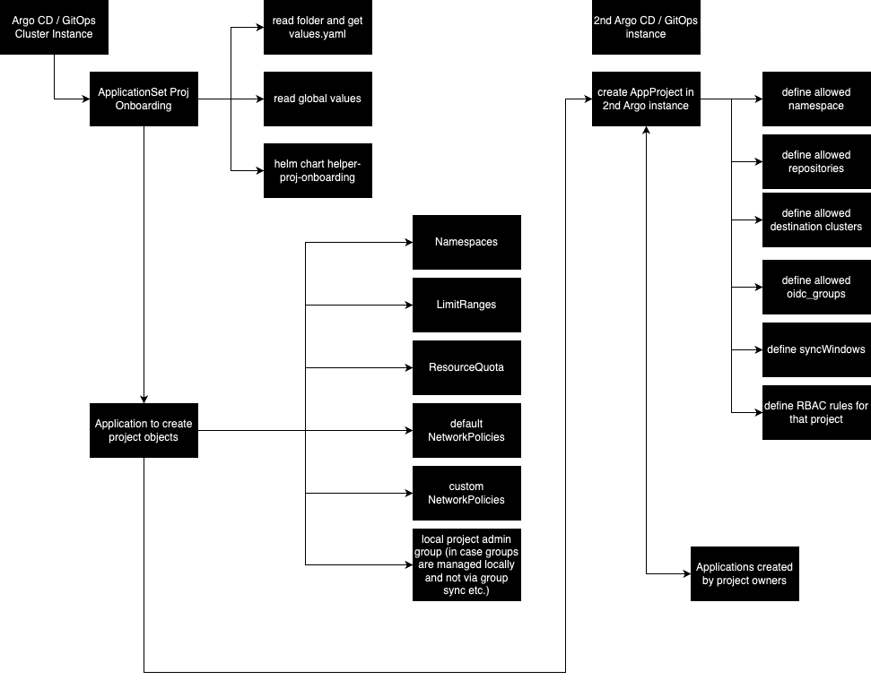
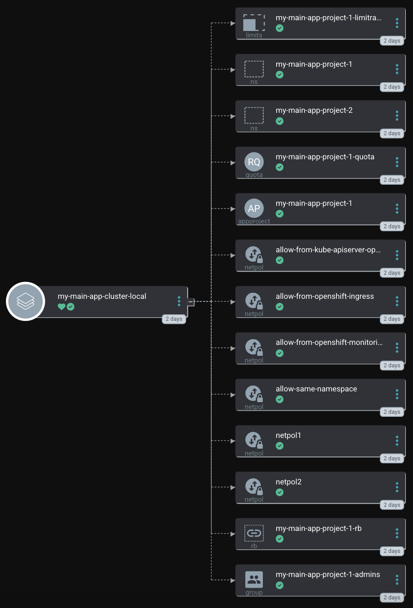
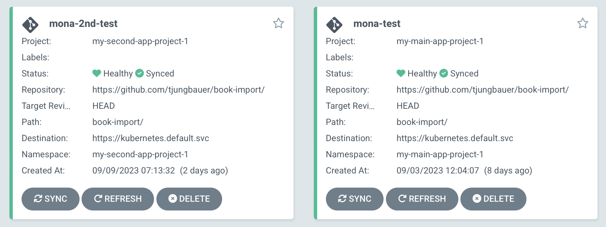

# Project Onboarding using GitOps and Helm

## Introduction

During the phase of OpenShift deployments at one point the question about project onboarding comes up. 
How can new customer or tenant be onboarded, so they can deploy their own workload onto the cluster(s)? While there are different ways from a process perspective (Service Now, Jira etc.) I focus on the Kubernetes objects that must be created at the end on each cluster.

In [A Guide to GitOps and Argo CD with RABC](https://cloud.redhat.com/blog/a-guide-to-using-gitops-and-argocd-with-rbac) I described how to set up GitOps RBAC rules in a way customers can work with their (and only their) projects. 

In this article, I will try to demonstrate a possibility to deploy per customer and per cluster:

- Namespace(s) including labels
- Local project admin group (in case groups are not managed otherwise, like LDAP Group Sync)
- Argo CD AppProject, that limits allowed repos, clusters, permissions etc.
- Resource Quotas for a project
- Limit Ranges for a project
- default Network Policies, which are:
  - Allow traffic in same Namespace
  - OpenShift Monitoring & API Server
  - OpenShift Ingress
  - Egress deny All
- Custom Network Policies

The idea here is to fully automate the creation of Kubernetes objects, by simply configuring a **Helm values-file** in a specific folder structure, that is observed by an **ApplicationSet**.

Each Kubernetes object can be enabled or disabled, to provide more flexibility. For example, if you do not want to work with Limit Ranges, you can disable (or completely remove the whole yaml block) and they will not be created. Same for any other object. 

Like in my previous article, the **Argo CD AppProject** object is used to limit a customer/project accordingly. 

I will be using a [Helm Chart](https://github.com/tjungbauer/helm-charts/tree/main/charts/helper-proj-onboarding) to create any object that is required. The reasons why I prefer Helm templating are:

- better repeatability 
- allows creating easy configuration for most important items (disable/enable objects)
- allows to create more complex configuration if needed (disable/enable objects)
- templating work better than patching in this case, since you do not need to deal with hundreds of overlays or patching configuration, but simply create a values-file and defining everything there. 

Still, other options like Kustomize can be used to achieve the same goal. At the end, it is up to you what you prefer. 

## Use Case

I would like to demonstrate the following use case:

- We have two applications, called: **my-main-app** and **my-second-app** that should be onboarded onto the cluster.
- **my-main-app** is using two Namespaces **my-main-app-project-1** and **my-main-app-project-2**. Maybe Mona uses this for frontnet and backend parts of the application.
- **Mona** is admin for both applications.
- **Peter** can managed only **my-main-app**.
- Mona and Peter request new projects (multiple) for the cluster which will be prepared by the cluster-admin who will create a new folder and generate a values-file (Helm) for that project and the target cluster.
- The cluster-admin synchronizes the project onboarding application in GitOps, which will create all required objects. (Namespace, ResourceQuota, Network Policies etc.)
- Mona and Peter can then use an application scoped GitOps instance (a 2nd instance) to deploy their application accordingly using the allowed namespace, repositories etc. (limited by GitOps RBAC rules).

**CAUTION**: When you install openshift-gitops (Argo CD) a centralized cluster scoped GitOps instance with a wide range of privileges is created. This instance should not be used by developers to onboard their applications. Instead, an application scoped GitOps instance should be created at least. 

**NOTE**: To make it easier for me, I am working with one cluster only. But different clusters can be used, all managed by a central GitOps instance.

## Prerequisites and assumptions

1. Users on the cluster: To test everything Mona and Peter must be able to authenticate. I used simple htpasswd authentication on my cluster. 
2. 2nd Argo CD instance (application scoped GitOps instance): To deploy customer workload onto the cluster the main openshift-gitops instance should NOT be used. Instead, an application scoped GitOps instance should be created at least.  
3. Example application: https://github.com/tjungbauer/book-import/
4. Developers must know and follow gitops approach. This is a process thing and common practice. **If it is not in Git, it does not exist**

## Correlation

The following diagram depicts the relationship between the different objects and GitOps instances. 



**NOTE**: The cluster-admins (platform team) have the responsibility of all the objects that are created here. Mona and Peter can then log into the application scoped GitOps instance (2nd Argo CD instance) and create and sync their Applications. 

## Directory Structure

ApplicationSets are used to create multiple Argo CD Applications automatically, based on a so-called Generator. In my case I am using the **Git Generator**, that walks through a defined folder, reads the configuration files (here Helm values-files) and uses the paramters generate the Argo CD Application.

The folder structure looks like the following: 

```bash
▶├──customer-projects
 │  ├──my-main-app
 │  │  └──cluster-local
 │  │    └──values.yaml
 │  ├──my-second-app
 │  │  └──cluster-local
 │  │    └──values.yaml
 │  └──values-global.yaml
```

Any customer is a separate folder and any customer can have one or more Namespaces (Projects). I am using the name of the application as separator, for example **my-main-app**. Below the application folder a folder for each cluster is created to distinguish the configuration for different clusters, for example **cluster-local**. Finally, in this folder a quite large **values.yaml** can be found that defines everything that is required for the project onboarding. 

The following ApplicationSet uses the files in **customer-projects/******/values.yaml** to fetch the parameters. 
It generates an Application named "<customer-name>-<path-name>" and uses the Helm Chart [Project Onboarding](https://github.com/tjungbauer/openshift-cluster-bootstrap/tree/main/clusters/all/project-onboarding) as source, providing two values-files:

- **values-global.yaml**: defines global values, currently the Namespace of the an application scoped GitOps instance and a list of environments.
- the **values.yaml** of the appropriate folder.

```yaml
apiVersion: argoproj.io/v1alpha1
kind: ApplicationSet
metadata:
  name: onboarding-customer-workload
  namespace: openshift-gitops
spec:
  syncPolicy:
    preserveResourcesOnDeletion: true # <1>
  generators:
    - git:
        files:
          - path: customer-projects/**/values.yaml # <2>
        repoURL: 'https://github.com/tjungbauer/openshift-cluster-bootstrap'
        revision: main
  template:
    metadata:
      name: '{{ customer.normalized }}-{{ path.basename }}' # <3>
    spec:
      info:
        - name: Description
          value: Onboarding Workload to the cluster
      destination:
        namespace: default
        name: '{{ environment }}' # <4>
      project: default
      source:
        helm:
          valueFiles: #<5>
            - '/{{ path }}/values.yaml'
            - /customer-projects/values-global.yaml
        path: clusters/all/project-onboarding
        repoURL: 'https://github.com/tjungbauer/openshift-cluster-bootstrap' # <6>
        targetRevision: main
```
**<1>** Applications, created by this ApplicationSet, shall remain even if the ApplicationSet gets deleted. \
**<2>** The path that shall be observed by this ApplicationSet. ** will return all files and directories recursively \
**<3>** The name that shall be used to generate an Application. The parameter **customer.normalized** is coming from the values-file the cluster-admin has generated. \
**<4>** The target cluster to which the customer workflow shall be deployed. This setting is coming from the values-file. \
**<5>** A list of values files, that shall be used. \
**<6>** The repo URL and path which shall be read.

The Helm Chart found at **clusters/all/project-onboarding** is only a wrapper, that will use the actual Helm Chart [helper-proj-onboarding](https://github.com/tjungbauer/helm-charts/tree/main/charts/helper-proj-onboarding) as a dependency. Here all the magic happens. The wrapper chart is used only to let the ApplicationSet search the GitHub repository and find all the required values-files, which I did not want to attach directly to actual Helm Chart.

## Values File: values-global.yaml 

This values-file defines global parameters. 
```yaml
global:
  # Namespace of application scoped GitOps instance, that is responsible to deploy workload onto the clusters
  application_gitops_namespace: gitops-application # <1>

  # cluster environments. A list of clusters that are known in Argo CD
  # name and url must be equal to what is defined in Argo CD
  envs: # <2>
    - name: in-cluster
      url: https://kubernetes.default.svc
    - name: prod-cluster
      url: https://production.cluster
```
**<1>** The name of the 2nd Argo CD instance (the application scoped GitOps instance)
**<2>** The list of clusters as known in Argo CD. 

## Values File: values.yaml 

The individual values files are separated by:

1. The customers/projects
2. The clusters

This file defines everything that is required for project onboarding. The example file is quite huge, and probably not everything is required for any onboarding. 
A full example can be found in my GitHub repository: [values.yaml](https://github.com/tjungbauer/openshift-cluster-bootstrap/blob/main/customer-projects/my-main-app/cluster-local/values.yaml)

### Basic parameters

The basic parameters define settings that are either used by the ApplicationSet or define anchors that are used multiple times or simply define values at the beginning of the file.

The following settings are currently used: 

1. **customer.name**: The name of the customer
2. **customer.normalized**: Argo CD requires normalized names (lower case and -). Since there is currently no way to automatically normalize the customer.name in the ApplicationSet, I decided to create a 2nd parameter.
3. **oidc_groups**: Name of the group that is allowed to work with the Argo CD project. This group might be created by the Helm Chart or must be known (i.e. is automatically synchronized)
4. **environment**: Defines the name of the cluster as known in Argo CD. **in-cluster** is the default (local) cluster that Argo CD will create. 
5. **environment-cluster-api**: API of the cluster. 

**NOTE**: **environment** and **environment-cluster-api** are defined in each values.yaml. Here, you define only one cluster since the values files are separated by cluster. There might be a better (global?) way to define them. 

```yaml
# Name of the custoemr or project. This must be the path.basename.
customer.name: my-main-app

# Normalized name of the customer or project. This must be LOWER case, otherwise Argo CD will fail
# This will be part the name the Argo CD ApplicationSet will use to create the Application.
customer.normalized: my-main-app # name for ArgoCD must be in lower case

# Group that is allowed in RBAC. This group can either be created using this Helm Chart (will be named as <namespace>-admin) or must be known (for example synced via LDAP Group Sync)
oidc_groups: &oidc-group my-main-app-project-1-admins

# Environment to which these values are valid, this should be the cluster name as visible in Argo CD
# In best case the same is equal to the folder we are currntly in, but this is optional.
environment: &environment in-cluster
# URL to cluster-API
environment-cluster-api: &environment-api https://kubernetes.default.svc
```

### Parameters passed to helper-proj-onboarding

Most parameters are handed over to the Chart **[helper-proj-onboarding](https://github.com/tjungbauer/openshift-cluster-bootstrap/blob/main/customer-projects/my-main-app/cluster-local/values.yaml)**. This is indicated by:

```yaml
# Parameters handed over to Sub-Chart helper-proj-onboarding
helper-proj-onboarding:
```

All parameters below are used by the Sub Chart. 

#### Namespaces

One or more Namespaces can be created for a customer. It defines a _name_, _additional_settings_ (additional labels) and _customer labels_. 
As any object a Namespace can be enabled or disabled. Be aware that simply disabling a Namespace does not mean that GitOps will automatically delete all objects, (not with the syncOptions that the ApplicationSet defines). In case a project shall be decomissioned the **prune** option must be selected during the Sync.

The defines the block, that might be used to create a new Namespace object:

```yaml
  # List of namespaces this customer shall manage.
  # A customer or project may consist of multiple namespace
  namespaces:

    # Name of the first Namespace
    - name: &name my-main-app-project-1

      # Is this Namespace enabled or not
      enabled: true

      # Additional labels for Podsecurity and Monitoring for the Namespace
      additional_settings:
        # Pod Security Standards
        # https://kubernetes.io/docs/concepts/security/pod-security-standards/#restricted
        # Possible values: Privileged, Baseline, Restricted
        # Privileged: Unrestricted policy, providing the widest possible level of permissions. This policy allows for known privilege escalations.
        # Baseline: Minimally restrictive policy which prevents known privilege escalations. Allows the default (minimally specified) Pod configuration.
        # Restricted: Heavily restricted policy, following current Pod hardening best practices.

        # Policy violations will trigger the addition of an audit annotation to the event recorded in the audit log, but are otherwise allowed.
        podsecurity_audit: restricted
        # Policy violations will trigger a user-facing warning, but are otherwise allowed.
        podsecurity_warn: restricted
        # Policy violations will cause the pod to be rejected.
        podsecurity_enforce: restricted
        cluster_monitoring: true

      # List of Labels that should be added to the Namespace
      labels:
        my_additional_label: my_label
        another_label: another_label
```

#### Manage local Project-Admin Group

It is possible to create a local Group of project admins. This can be used if there is no other mechanism in place, for example LDAP Group Sync. 

In this example a local Admin Group will be generated (name <namespace name>-admins) with two users assigned to that Group.
The RoleBinding will use the role **admin** per default. In case you are using your own Role, you can define it here.

**NOTE**: You should always define a **local_admin_group** block, even if the Group object is managed by some other option. It will at least create a RoleBinding and assigns the ClusterRole to the **group_name**

```yaml
      # Create a local Group with Admin users and the required rolebinding
      # If other systems, like LDAP Group sync is used, you will probaably not need this and can either disable it or remove the whole block.
      local_admin_group:
        enabled: true
        # group_name: my_group_name # <1>
        # optional parameter, default would be "admin"
        clusterrole: admin # <2>
        # List of users
        users: # <3>
          - mona
          - peter
```
**<1>** Optional: name of the group. If not set it will be automatically generated based on the Namespace name \
**<2>** Optional: Name of the ClusterRole. If not set it will automatically use **admin** \
**<3>** List of users assigned to the group. If not set a RoleBinding will be generated only. 

#### Argo CD RBAC

Projects inside Argo CD (not to be confused with Kubernetes Projects) help you to logically group applications together. In our example I create an Argo CD project for every Namespace a customer manages. This will allow that Mona or Peter can manage the Application via Argo CD. Such objects are defined by the **AppProject** object which is documented in the [Argo CD documentation](https://argo-cd.readthedocs.io/en/stable/user-guide/projects/)

These projects allow to
- restrict allowed sources (i.e., Git repositories)
- restrict destination clusters and namespaces
- restrict which objects are allowed to be deployed
- define project roles to provide application RBAC (bound to OIDC groups and/or JWT tokens) 
- define timeframes when Application synchronisation is allowed or not.

The example defines the following, huge block. All parameters should be set here since no default values will be set for most of them.

```yaml
      # Creation of Argo CD Project
      argocd_rbac_setup:
        # This is required to build the rbac rules correctly. Theoretically, you can create multiple RBAC rules, but usually you create one per project/customer
        argocd_project_1:
          enabled: true # <1>
          # Name of the AppProject is set to the customers Namespace. Which means, each Namespace will get it's own AppProject
          name: *name # <2>
          # List of allowed repositories. If the customer tries to use a different repo, Argo CD will deny it. * can be used to allow all.
          sourceRepos: # <4>
            - 'https://github.com/tjungbauer/book-import/'
          rbac: # <5>
              # Name of the RBAC rule
            - name: write
              # Description of the RBAC rule
              description: "Group to deploy on DEV environment"
              # List of OCP groups that is allowed to manage objects in this project
              oidc_groups: # <6>
                - *oidc-group
              # Project policies
              # This will limit a project to specific actions
              # Parameters:
              #   - action: Mandatory, either get, create, update, delete, sync or override
              #   - permissions: allow or deny (Default: deny)
              #   - resource: i.e applications (Default: applications)
              #   - object: Which kind of objects can be managed, default "*" (all) inside the namespace
              policies: # <7>
                - action: get # get, create, update, delete, sync, override
                  permission: allow # allow or deny
                  object: '*' # which kind of objects can be managed, default "*" (all) inside the namespace
                - action: create
                  permission: allow
                - action: update
                  permission: allow
                - action: delete
                  permission: allow
                - action: sync
                  permission: allow
                - action: override
                  permission: allow
          # Sync Windows - when application can be synced or not. Typically used to prevent automatic synchronization during specific time frames
          # but can be used to limit the allowed syncs as well.
          syncWindows: # <8>
            - applications:
                - '*'
              clusters:
                - *environment # the cluster we care currently configuring
              namespaces:
                - *name # the namespace of this application
              timezone: 'Europe/Amsterdam' # timezone, default Europe/Amsterdam
              duration: 1h # duration, for example "30m" or "1h" (default 1h)
              kind: allow # allow or deny (default allow)
              manualSync: true # is manual sync allowed ot not (default true)
              schedule: '* * * * *' # cronjob like schedule: Min, Hour, Day, Month, Weekday (default '55 0 1 12 *' )
```
**<1>** Enabled true/false \
**<2>** Name of the AppProject object, for better cross-reference I am using the name of the namespace here. \
**<3>** List of allowed source repositories \
**<4>** List of RBAC rules with name and description. While it is possible to create multiple rules, I usually work with one definition per Namespace. However, when you have multiple groups with a fine granular permission matrix, you might need to define more. \
**<5>** List of OpenShift Groups that are allowed for this project. The group name must be known or is generated by the Helm chart. \
**<6>** Policies, containing the parameters: action (get, create, update, delete, sync or override), permissions (deny, allow), resources (i.e. applications (==default value)) and object (default = *) \
**<7>** Definition of sync windows (timeframe when synchronization is allowed or disallowed). It defines the application, environment, namespace, as well as a timezone a timeframe and if a manual synchronization is allowed or not.  

#### ResourceQuota

A ResourceQuota object defines limits per resource for a project. It can limit the quantity of objects (i.e. maximum number of Pods) as well as the amount of compute resources that can be requests and used (i.e. cpu and memory).

The following defines several settings for a ResourceQuota. Only the ones that are defined will be created. Any undefined value means that there is no quota thus no limit is configured for that specific object/compute resource. This makes sure that you define useful values for the quotas that fit into your individual environment. 

**NOTE**: Only hard limits are set currently, but not scopes.

```yaml
      # Configure ResourceQuotas
      # Here are a lot of examples, typically, you do not need all of these. cpu/memory is a good start for most use cases.
      resourceQuotas:
        # Enable Quotas or not. You can either disable it or remove the whole block
        enabled: true
        # limits of Pods, CPU, Memory, storage, secrets... etc. etc.
        # Byte values will be replace: gi -> Gi, mi -> Mi
        pods: 4 # <1>
        cpu: 4
        memory: 4Gi
        ephemeral_storage: 4Gi
        replicationcontrollers: 20
        resourcequotas: 20
        services: 100
        secrets: 100
        configmaps: 100
        persistentvolumeclaims: 10
        limits:
          cpu: 4
          memory: 4gi # lower case will be automatically replaced
          ephemeral_storage: 4mi # lower case will be automatically replaced
        requests:
          cpu: 1
          memory: 2Gi
          storage: 50Gi
          ephemeral_storage: 2Gi
        # add here a list of your storage classes you would like to limit as well.
        storageclasses:
          # for example: Storageclass "bronze" has a request limit and a limit ov max. PVCs.
          bronze.storageclass.storage.k8s.io/requests.storage: "10Gi"
          bronze.storageclass.storage.k8s.io/persistentvolumeclaims: "10"
```
**<1>** List of hard limits currently supported by the Helm Chart. You only need to define the limits that you actually want to set.

#### Limit Ranges

A limit range can restrict the consumption of a resource inside a project. It is possible to set specific resource limits for a pod, container, image, image stream, or persistent volume claim (PVC).

Currently, the Helm Chart supports Container, Pods, and PVCs. It is recommended to set LimitRanges and convince developers to set resources accordingly in their Kubernetes objects. 

However, this is sometimes not the case. If you want to set a LimitRange you can define the following block in the values-file:

```yaml
      # Limit Ranges, are optional, if not set here, then default (very small ones) are used
      limitRanges:
        # Enable Quotas or not. You can either disable it or remove the whole block
        enabled: true
        pod: # <1>
          max:
            cpu: 4
            memory: 4Gi
          min:
            cpu: 500m
            memory: 500Mi
        container: # <2>
          max:
            cpu: 4
            memory: 4Gi
          min:
            cpu: 500m
            memory: 500Mi
          default:
            cpu: 1
            memory: 4Gi
          defaultRequest:
            cpu: 1
            memory: 2Gi
        pvc: # <3>
          min:
            storage: 1Gi
          max:
            storage: 20Gi
```
**<1>** LimitRanges for Pods. \
**<2>** LimitRanges for Containers \
**<3>** LimitRanges for PVCs

Like for ResourceQuotas only defined settings will be created. If, for example, nothing is set for pod.max.cpu then this value will be ignored. 

#### Default Network Policies

**NOTE**: Per default the project admin role can modify Network Policies. This means they can change, create, or delete them. It is recommended to create a special Role in OpenShift, which does not provide this privilege, if Network Policies shall be managed at a central place and not by the project admins themselves.

Network Policies limit the allowed traffic for each Namespace and are recommended to be set from the very beginning. 
They are individual for every project, but there are some default policies that should be considered. 

The 5 default policies that the Helm Chart would create, if you do not disable them are:

1. **Allow Ingress traffic** from OpenShift Router (aka allow external traffic to reach your application)
2. Allow **OpenShift Monitoring** to fetch metrics
3. Allow **communication inside one Namespace** (pod to pod in the same Namespace)
4. Allow **Kube-API server** to interact with the objects
5. **Deny egress traffic** ... no egress traffic at all

The Helm chart will set them automatically, unless otherwise defined in the values-file.

The following example would disable the "**deny egress all**" policy, which means that egress traffic to any destination is allowed. 

```yaml
      # For example: I would like to disable "deny all egress" (which means the Pods can reach any external destination).
      default_policies:
        # disable_allow_from_ingress: false
        # disable_allow_from_monitoring: false
        # disable_allow_from_same_namespace: false
        # disable_allow_kube_apiserver: false
        disable_deny_all_egress: true # This default policy will not be created, while the others will be.
```

#### Additional Network Policies

It is possible to define additional Network Policies using the Helm Chart. At a first look these objects look quite complex (also on the second look). However, you can define a list of policies, by simply define a Name, a podSelector and Ingress or Egress Rules, which can have a podSelector as well, or a NamespaceSelector or simply an IP-Block and define a list of protocols and ports.

The example values-file defines two policies: **netpol1** and **netpol2**.

**NOTE**: It is recommended to work with Network Policies from the very beginning of your Container journey. Adding them later might be very complex, because nobody knows which sources or destinations shall be allowed. 

**NOTE**: Per default the project admin role can modify Network Policies. This means they can change, create, or delete them. It is recommended to create a special Role in OpenShift, which does not provide this privilege, if Network Policies shall be managed centrally.

```yaml
      # Additional custom Network Policies
      # I created this to be able to create Policies using a Helm chart. It might look complex but it is actually quite straight forward.
      #
      # 1. Defaine a PodsSelect (or use all pods see example 2)
      # 2. Define Ingress rules with selectors and ports or IP addresses
      # 3. Optionally define egress Rules
      networkpolicies:
          # List of NetworkPolicies to create with name and switch if active or not
        - name: netpol1
          active: true

          # The PodSelect based on matchLabels. Could be empty as well
          podSelector:
            matchLabels:
              app: myapplication
              app2: myapplication2

          # Incoming Rules, based on Port and Selectors (Pod and Namespace)
          ingressRules:
            - selectors:
                  - podSelector:
                      matchLabels:
                        app: myapplication
                        version: '1.0'
                  - namespaceSelector:
                      matchLabels:
                        testnamespace: "true"
              ports:
                - protocol: TCP
                  port: 443

          # Outgoing Rules, based on Port and Selectors
          egressRules:
            - selectors: []
              ports:
                - port: 2
                  protocol: UDP
            - ports:
                - port: 443
                  protocol: TCP
              selectors:
                - podSelector:
                    matchLabels:
                      app: myapplication
                      version: '1.0'

          # 2nd example
        - name: netpol2
          active: true

          podSelector: {}

          # Incoming Rules, based on ipBlock and Selectors
          ingressRules:
            - selectors:
                  - podSelector: {}
                  - namespaceSelector:
                      matchLabels:
                        testnamespace: "testnamespace"
                  - ipBlock:
                      cidr: 127.0.0.1/24
                      except:
                        - 127.0.0.2/32
              ports:
                - protocol: TCP
                  port: 443
```

## Bring Everything Together

Mona and Peter requested the new Namespaces **my-main-app-project-1** and **my-main-app-project-2** for their project **my-main-app**. They defined the name, which group shall have access and the quota and network policies they will require. Maybe they ordered such project via some tooling, like Jira. 

The administrator of the cluster created a new folder and a values-file that define all required parameters. 

**NOTE** A full example can be found in my GitHub repository: [values.yaml](https://github.com/tjungbauer/openshift-cluster-bootstrap/blob/main/customer-projects/my-main-app/cluster-local/values.yaml)

The ApplicationSet will automatically fetch the new folder and create the Application inside Argo CD. 

GitOps uses the Helm Chart and would like to create all requested objects. 



Once synchronised, Mona can log into the application scoped GitOps instance and create the Applications she requires and sync here workload onto the cluster. She is limited by the AppProject and can only use the allowed Namespaces, clusters, repositories etc.



## Summary 

This concludes this article and how it is possible to onboard new projects into OpenShift using a GitOps approach. It is one option of many. I personally prefer Helm Charts over plain yaml or Kustomize. However, they will work as well. The most important part here is not the actual tool, but that all objects and any configurations are defined in Git where a GitOps agent (in our case Argo CD) can fetch them and sync them onto the cluster.